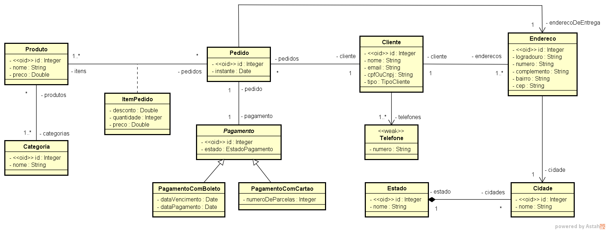

# Projeto Java Spring Boot

Aplicação backend.

## Tecnologias utilizadas
- Java
- Spring Boot
- JPA / Hibernate
- Maven

## Diagramas de Classes Implementado

## EndPoints disponibilizados

/categorias
